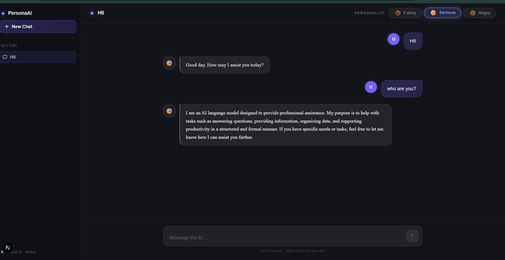
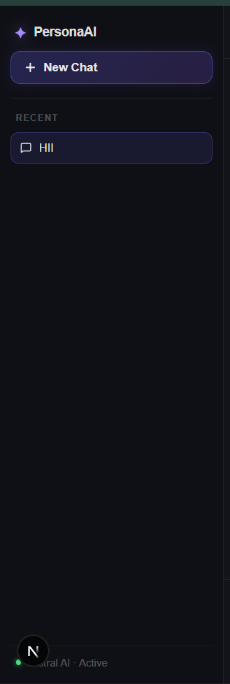
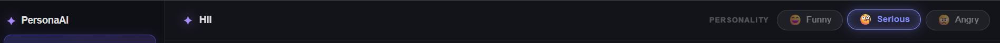

<div align="center">

# 🤖 AI Personality Chatbot

**A full-stack AI chatbot with dynamic personalities, persistent memory, and a modern dark UI**

[](https://fastapi.tiangolo.com/)
[](https://nextjs.org/)
[](https://langchain.com/)
[](https://mongodb.com/)
[](https://mistral.ai/)

[Features](#-features) · [Architecture](#-architecture) · [Getting Started](#-getting-started) · [Tech Stack](#-tech-stack) · [Screenshots](#-screenshots)

</div>

---

## 📌 Overview

AI Personality Chatbot is a **production-style full-stack AI application** that replicates a ChatGPT-style experience with one key twist — users can switch between distinct AI personalities in real time. Built with **FastAPI**, **Next.js 14**, **LangChain**, and **Mistral AI**, the system maintains **session-aware memory via MongoDB**, giving each conversation a coherent context.

This project demonstrates real-world AI engineering: prompt engineering, session management, LLM integration, and clean full-stack architecture.

---

## ✨ Features

### 🧠 AI Capabilities
- **3 Personality Modes** — Switch between `😄 Funny`, `🧐 Serious`, and `😠 Angry` at any time
- **Engineered System Prompts** — Each personality uses carefully tuned prompts for consistent tone control
- **Session-Aware Memory** — Conversation history is persisted in MongoDB and injected into every request via LangChain
- **Context-Aware Responses** — The model always has full context of the ongoing conversation

### 💬 Chat Experience
- ChatGPT-style dark theme UI built in Next.js + Tailwind CSS
- Animated typing indicator while AI is generating
- Create, switch, and delete multiple chat sessions from a sidebar
- Auto-scroll to the latest message
- Enter-to-send support
- Clean, accessible message bubble layout

---

## 🏗️ Architecture

```
User (Browser)
     │
     ▼
Next.js 14 Frontend       ← TypeScript + Tailwind CSS
     │  HTTP (Axios)
     ▼
FastAPI Backend            ← Python REST API
     │
     ▼
LangChain                  ← Conversation chain + memory management
     │
     ├──▶ Mistral AI API   ← LLM inference
     │
     └──▶ MongoDB          ← Session history storage
```

---

## 🛠️ Tech Stack

| Layer | Technology |
|---|---|
| Frontend | Next.js 14, TypeScript, Tailwind CSS, Axios, Lucide Icons |
| Backend | Python 3.x, FastAPI, Uvicorn, Pydantic |
| AI / LLM | Mistral AI API, LangChain |
| Database | MongoDB (local or Atlas) |
| Dev Tools | python-dotenv, UUID |

---

## 📁 Project Structure

```
ai-personality-chatbot/
│
├── backend/
│   ├── main.py              # FastAPI app entry point & routes
│   ├── chat.py              # LangChain + Mistral integration
│   ├── database.py          # MongoDB connection & session logic
│   ├── .env                 # API keys (not committed)
│   └── requirements.txt
│
└── frontend/
    ├── app/
    │   ├── page.tsx
    │   ├── layout.tsx
    │   ├── globals.css
    │   └── components/
    │       ├── ChatWindow.tsx
    │       ├── Sidebar.tsx
    │       ├── MessageBubble.tsx
    │       ├── PersonalitySelector.tsx
    │       └── InputBar.tsx
    ├── .env.local
    └── package.json
```

---

## 🚀 Getting Started

### Prerequisites

- Python 3.9+
- Node.js 18+
- MongoDB (local instance or [Atlas](https://www.mongodb.com/atlas))
- [Mistral AI API Key](https://console.mistral.ai/)

---

### 1. Clone the Repository

```bash
git clone https://github.com/YOUR_USERNAME/ai-personality-chatbot.git
cd ai-personality-chatbot
```

---

### 2. Backend Setup

```bash
cd backend
python -m venv .venv
.venv\Scripts\Activate.ps1       # Windows
# source .venv/bin/activate       # macOS/Linux

pip install -r requirements.txt
```

Create a `.env` file inside `backend/`:

```env
MISTRAL_API_KEY=your_mistral_api_key_here
MONGODB_URI=mongodb://localhost:27017
```

Start the backend server:

```bash
uvicorn main:app --reload
```

- API base URL: `http://localhost:8000`
- Interactive docs: `http://localhost:8000/docs`

---

### 3. Frontend Setup

```bash
cd frontend
npm install
npm run dev
```

Create a `.env.local` file inside `frontend/`:

```env
NEXT_PUBLIC_API_URL=http://localhost:8000
```

- Frontend URL: `http://localhost:3000`

---

## 🔄 How It Works

```
1. User selects a personality (Funny / Serious / Angry)
2. User types and sends a message
3. Frontend sends POST /chat to FastAPI with { session_id, message, personality }
4. Backend fetches session history from MongoDB
5. LangChain constructs a prompt: system message (personality) + conversation history + new message
6. Mistral AI generates a response
7. Response + updated history are stored back in MongoDB
8. Response is returned to the frontend
9. UI renders the new message bubble dynamically
```

---

## 📸 Screenshots

| Chat Interface | Sidebar | Personality Modes |
|---|---|---|
|  |  |  |

---

## 🔮 Roadmap

- [ ] Streaming responses (SSE)
- [ ] RAG (Retrieval-Augmented Generation) with uploaded documents
- [ ] AI Agents with tool use
- [ ] User authentication (JWT)
- [ ] Deployment (Vercel + Railway)
- [ ] Rate limiting & token usage tracking
- [ ] Markdown rendering in chat
- [ ] Mobile-responsive layout

---

## 🧩 What I Learned

- Building production-style full-stack AI applications
- Prompt engineering and system message design for personality control
- Session-based memory architecture with MongoDB + LangChain
- REST API design and development with FastAPI
- Structuring scalable Next.js 14 applications with TypeScript
- Clean separation of concerns across a multi-layer AI system

---

## ⚠️ Notes

- API keys and `.env` files are **not included** in this repository. Set them up locally before running.
- This project is built for **educational and portfolio purposes**.
- MongoDB must be running locally or replaced with a valid Atlas URI.

---

## 📄 License

This project is open for learning and portfolio demonstration. Feel free to fork and build on it.

---

<div align="center">

**Built by [Raushan Gupta](https://github.com/RaushanGupta1516)**

</div>
